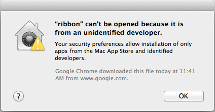
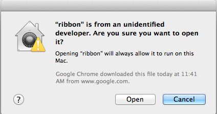

# Ribbons 0.1

Mac OSX 10.6+

---

Hi! :)

Thanks for downloading and testing **Ribbons**! This app is still under development, so you may find bug along the way... It woul be great if you could report them to my email gianordoligabriel@gmail.com. Please let me know if you see room for improvement in anything else, like:

* naming
* interface
* effects
* (new) functions
* ...?

best,

Gabriel

## Installation

Simply execute the *ribbons* file inside the zip. You may see this alert:

Since Mac OSX 10.8 (Mountain Lion), apps downloaded not downloaded from the App Store are blocked by by default. To open the app, Control + click on it and select *Open*:

On the new alert window, simply confirm clicking on *Open*.

If you're finding this suspicious, check out this information on the [Apple website](http://support.apple.com/kb/ph11436)!

## Tools

### MODES

These options change the mouse function and the shape visualization. The app starts in **DRAW** mode by default. All modes but **DRAW** change the visualization to 3D.

* **DRAW**: Free drawing tool. Shapes are displayed as vector, without any 3D rendering.

* **CAMERA**: Set the visualization mode to 3D. The mouse functions enabled in this mode are:

	* mouse drag: rotate camera
	* ALT + mouse drag: pan
	* CTRL + mouse mouse drag: zoom

* **REPULSION**: Repels the shapes with the mouse. The area and strength of the repulsion are set by the options **FORCE RADIUS** and **FORCE STRENGTH**.

* **ATTRACTION**: Attracts the shapes with the mouse. The area and strength of the repulsion are set by the options **FORCE RADIUS** and **FORCE STRENGTH**.

* **WIND**: Faz o mouse atrair as formas desenhadas. A área e força de repulsão podem ser controladas com as opções **FORCE RADIUS** e **FORCE STRENGTH**.

### SHAPES

* **APPLY SMOOTHING**: Simplify the shapes extracting some vertices. You can undo this function using the command **RESET SHAPES**.

* **RESET SHAPES**: Reset the shapes to their original form, only if they were not erased using **ERASE SHAPES**. This command resets both shape transformations (**APPLY SMOOTHING**) and 3D effects.
 
* **ERASE SHAPES**: Erase all shapes drawn. This action can't be undone.

* **COLOR**: Changes the mix of **RED**, **GREEN** and **BLUE** of the color.

### 3D

Changes made in this menu are only visible when in 3D mode.

* **THICKNESS**: Changes the ribbon thickness.

* **DEPTH**: Changes the depth (z) of the ribbon's vertices, according to the sequence that they have been drawn. Vertices drawn later in a shape will look further than the first ones.

* **OSCILLATE**: toggles the shape oscillation.

### VIDEO

* **PLAYBACK**: Controls how much of the shape is displayed.

* **TAKE SNAPSHOT**: Saves the current view as an image, with transparent background in tif format.

* **RECORD SEQUENCE**: Saves the current view as a sequence of images, with transparent background in tif format. This option can be combined with all 3D modes — camera movements and forces — or with the **PLAYBACK** to create an animation, for instance.

### FORCE

These options are only available when in **REPULSION** or **ATRACTION** mode.

* **FORCE RADIUS**: Sets the area of the applied force.

* **FORCE STRENGTH**: Sets the intensity of the applied force.

### OSCILLATION

These options are not visible when in **DRAW** mode.

* **AMPLITUDE**: Changes the amplitude of the wave.

* **FREQUENCY**: Changes the wave frequency.

* **LENGTH**: Changes the wave length.